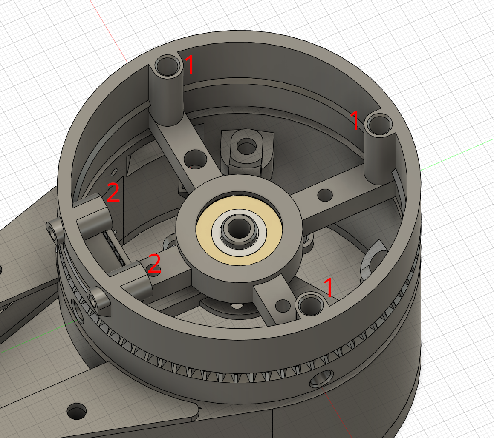
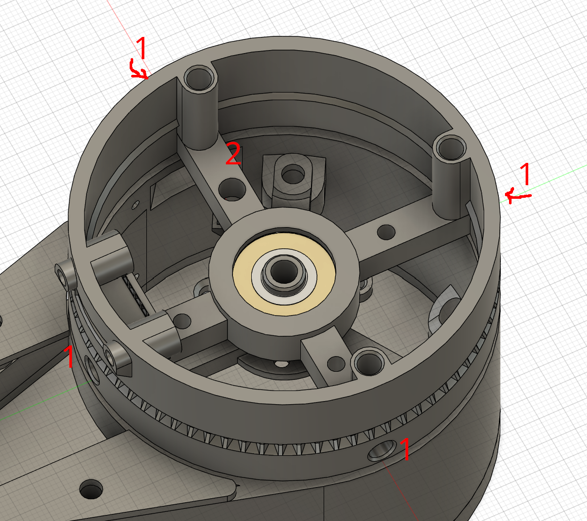
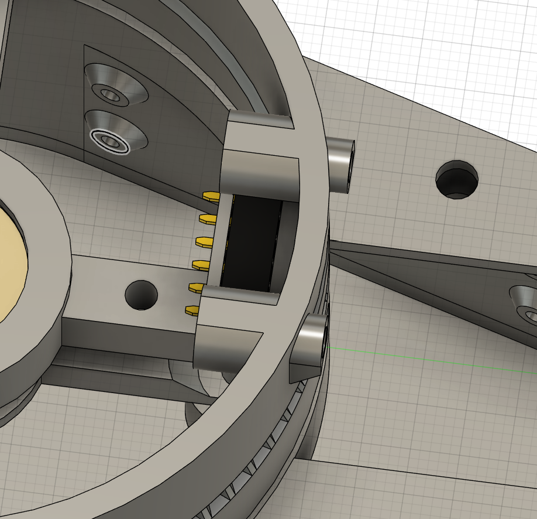
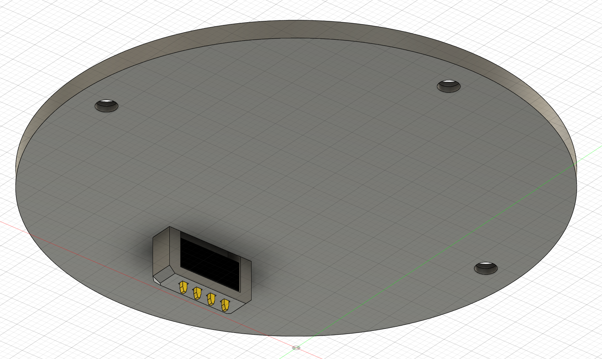
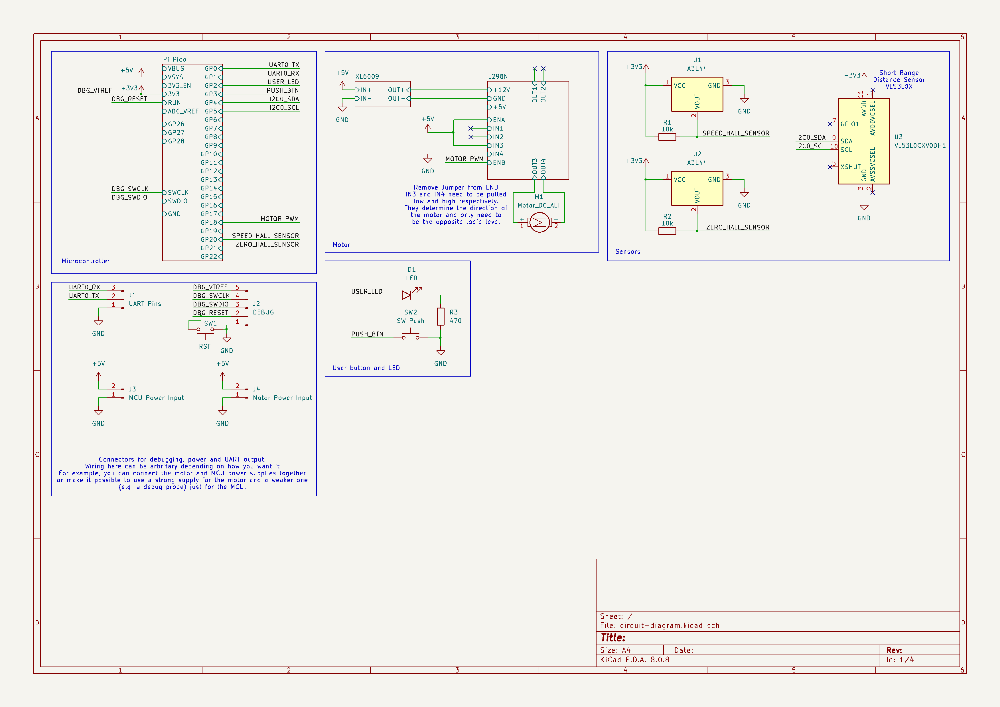
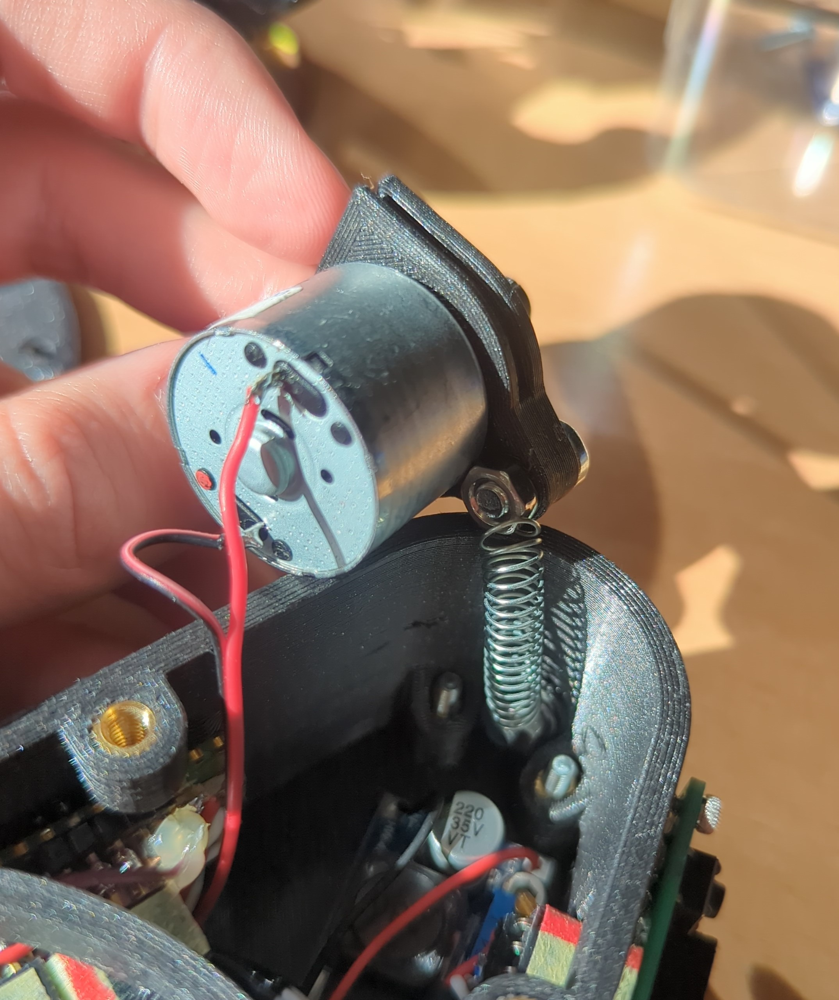

# Assembly
**Required Tools:**
- Soldering Tools
- Heatgun
- Screwdrivers
- Hot glue

1. Installing heat-set inserts
   1. Base
    
    - Install 5x M4x8x6mm threaded inserts into the holes labeled with **1**.
    - Install 3x M3x6x5mm threaded inserts into the holes labeled with **2**.
   2. Dome
    
    - Install 3x M3x6x5mm threaded inserts into the holes labeled with **1**.
    - (Optional) Install 2x M3x6x5mm threaded inserts into the holes labeled with **2**.
2. Installing magnets 
   **Important:** Ensure the correct side of the magnets faces towards the hall
   effect sensors. To test this, put a hall effect sensor on a breadboard and connect
   its output to an LED. If the LED reacts when you hold a magnet close to the angled
   side of the hall effect sensor, mark that side using a permanent marker or similar
   and ensure that this side faces the sensor on the dome later.

   
   - Using the heatgun, carefully heat up the holes for the magnets marked with **1**
     and push in the magnets with their marked side facing outward. If you don't know
     what is meant with marked side, read the note above the image.
    - Repeat the process from above with the hole marked with a **2** and have
     the marked  side facing downwards. Make sure the magnet does not extend out
     of the hole on the bottom.
3. Installing sensor sockets
   Install the 4pin and 6pin 2.54mm pinsockets as shown in the images by pushing them
   in from the front or top respectively. If you have clearance issues, again use the
   heatgun.
   
   
4. Installing hall-effect sensors
   - Push one of the sensors through the small holes on the outside of the case.
     Make sure the angled side of the sensor faces towards the center of the sensor dome.
     If the holes were too small for the printer you can use a soldering iron to heat
     up the individual leads and melt new holes for the sensor into the plastic.
   - Solder some leads to the 2 hall effect sensors.
   - Secure the hall sensor mounted to the base using hotglue.
     
   - Mount the second sensor to the protrusion on the hollow axis-mount for the bearing.
     Again ensure the angled side is facing upwards.
     

5. Installing bearing and slipring
   - Press the bearing into the slot on the dome. If you have trouble with clearances,
     heat up the hole slightly using the heatgun to soften the plastic a bit before
     pushing the bearing in.
   - Repeat the process for the hollow axis shaft but be especially
     careful here to not overheat the plastic and deform it.
   - Pull the wires of the slipring through the hollow shaft with the rotating part
     facing towards the bearing and screw it into the plastic using 3x M3x4 screws.
    The final result should look something like this:
    
6. Solder the electronics according the circuit diagram.
   
   I would recommend using as many connectors as possible to facilitate easier
   (dis-)assembly. Be mindful of the motor size when choosing connector locations.
   In some cases it may make sense to use a right angle connector.
   For reference, this is how I assembled my perfboard.
   
   
7. Mount the motor to its mounting bracket.
   Depending on which DC motor you get the mounting holes on the corresponding
   3D printed bracket may not line up. In that case you will need to edit the model
   yourself or drill fitting holes in the existing part.

   The 3D model is located in the [model](./model/) directory as a step file.
9. Push the driveshaft onto the motor motor shaft. Feel free to use the heatgun
   again here. Try and line it up as much as possible in height with the slot on the
   sensor dome assembly.
10. Mount the spring to the motor and the case using 2x M4x10 bolts and nuts.
    This part can be a bit finnicky.
    
11. Mount the LM298N and Xl6009 boards to the baseplate using M3x4 bolts and
    the Pico to the wall of the base with 2x M2x4 bolts. Mount the baseplate using 3x M3x16 countersunk screws.
12. Plug everything in you can and mount the motor with the corresponding cover plate
    using another 2x M4x10 bolts. Make sure the motor can move more or less freely
    back and forth and isn't blocked by any wires.
13. Plug in the slipring and screw on the axis mount of the dome to the main body.
14. Screw in the dome cover plate and plug in the 2 sensors.